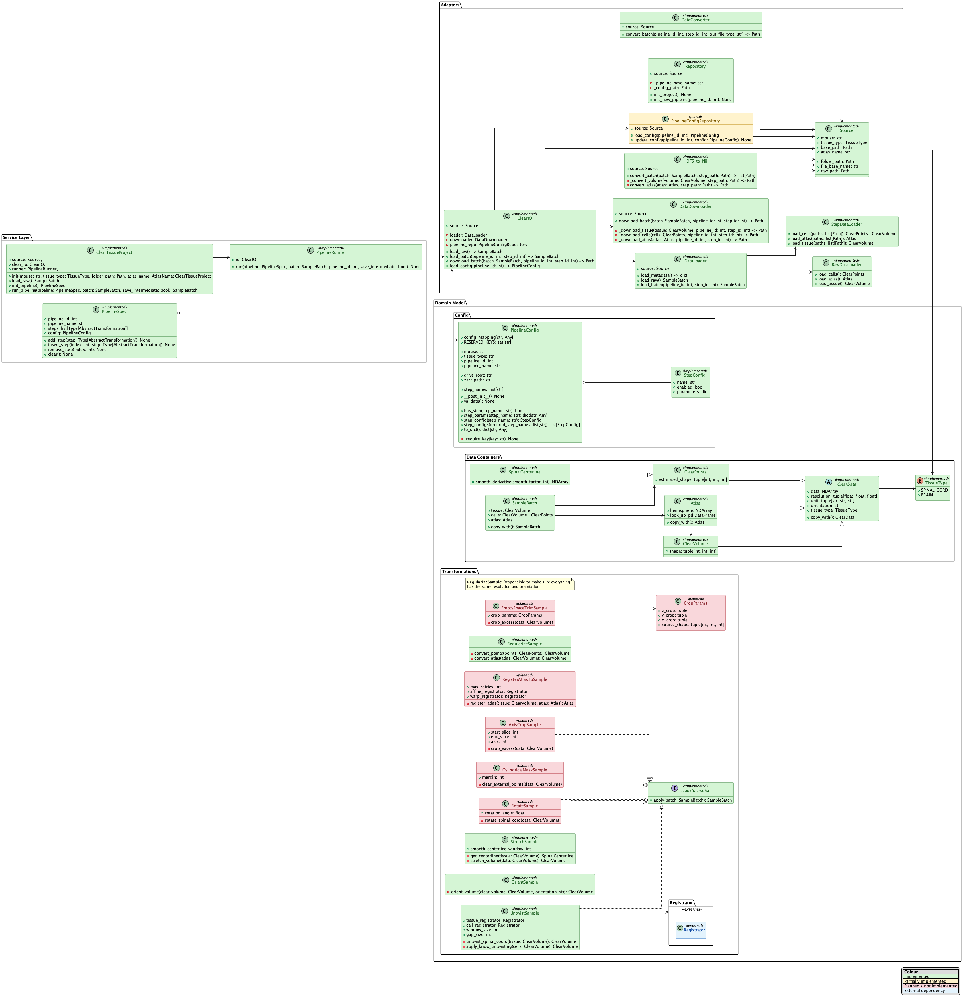

    
    
    
    
    

# ClearTissue
This is a tool box to help with your clear tissue analysis, making whole tissue analysis possible and simple

## Architecture
The current architecture of this package is described in the following claqss UML:

